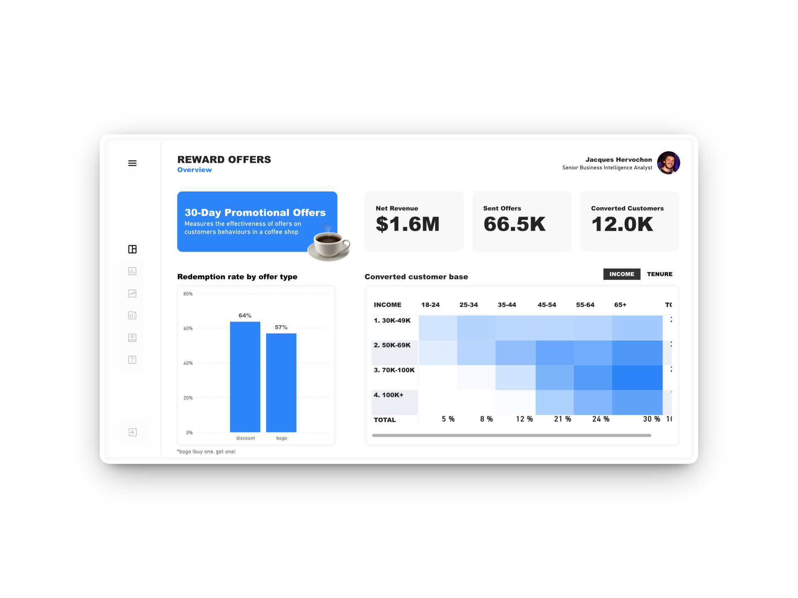

# Power BI Project: Promotional Campaign Analysis Dashboard

## Overview 
Proviving a comprehensive view of behaviours of a coffee shop members over a 30-day period, including their transactions and responses to promotional offers.

👉 [Power BI Dashboard](https://app.powerbi.com/view?r=eyJrIjoiZDlmNzM2NDAtMjkxMC00NzdjLWI5ZTgtNmJmMGRiYWY5Njg5IiwidCI6IjdkNDg3NDc4LWNhMjYtNDkxOS05MDlhLTBjNDU3MTQyYzczNCJ9&pageName=87f77b55a00e014be595)



## 📂 Data model 

→ `customers.csv`  

| Column               | Type        | Description                                |
|----------------------|------------|--------------------------------------------|
| customer_id       | text       | Unique customer ID (primary key)       |
| became_member_on       | date       | Date when the customer created their account (yyyymmdd)       |
| gender       | text       | Customer's gender: (M)ale, (F)emale, or (O)ther"       |
| age       | integer       | Customer's age       |
| income       | float       | Customer's estimated annual income, in USD       |

→ `offers.csv`  

| Column               | Type        | Description                                |
|----------------------|------------|--------------------------------------------|
| offer_id       | text       | Unique offer ID (primary key)      |
| offer_type       | text       | Type of offer: bogo (buy one, get one), discount, or informational      |
| difficulty       | integer       | Minimum amount required to spend in order to be able to complete the offer     |
| reward       | integer       | Reward ($) obtained by completing the offer    |
| duration       | integer       | Days a customer has to complete the offer once they have received it       |
| channels       | text       | List of marketing channels used to send the offer to customers      |

→ `events.csv`

| Column               | Type        | Description                                           |
|----------------------|------------|-------------------------------------------------------|
| customer_id       | text       | Customer the event is associated with  (foreign key)     |
| event       | text       | Description of the event (transaction, offer received, offer viewed, or offer completed)      |
| value       | text       | Dictionary of values associated with the event (amount for transactions, offer_id for offers received and viewed, and offer_id & reward for offers completed).     |
| time       | integer       | Hours passed in the 30-day period (starting at 0)    | 


## 🧹  Data cleaning 

→ `customers.csv` 
- Customer categorisation by age, income and tenure.
- 2,175 customers had missing details (12.8%) and were excluded from the analysis **to ensure a clearer view of customer behavior by segment.**

→ `events.csv` 
- Unnest value to properly manipulate the data.

**1. value → offer_id**
```sql
, case 
   when value like '%offer id%' then regexp_replace(value, '.*offer id'':[[:space:]]*''([^'']+)''.*', '\1') 
   when value like '%offer_id%' then regexp_replace(value, '.*offer_id'':[[:space:]]*''([^'']+)''.*', '\1')
   else null 
end as offer_id
```
| value | offer_id | 
|-------|---------|
| {'offer id': '5a8bc65990b245e5a138643cd4eb9837'}     | 5a8bc65990b245e5a138643cd4eb9837 |

**2. value → reward**
```sql
, case when value like '%reward%' then regexp_replace(value, '.*reward'':[[:space:]]*([0-9]+).*', '\1')::int else 0 end AS reward
```
| value | reward | 
|-------|---------|
| {'offer_id': '2298d6c36e964ae4a3e7e9706d1fb8c2', 'reward': 3}    | 3 |

**3. value → amount**
```sql
, case when value like '%amount%' then regexp_replace(value, '.*amount'':[[:space:]]*(-?[0-9]+(?:\.[0-9]+)?).*', '\1')::float else 0 end AS amount
```
| value | amount | 
|-------|---------|
| {'amount': 11.93}           | 11.93 |


✅ This transformation revealed duplicate records, particularly in the offer completions events, which were removed to avoid overcounting.

Below is an extract showing the number of duplicate records associated with each number, impacting 317 customers (2.5%) and resulting in 374 duplicate events that were originally overcounted.

| customer_id | freq_old_table | freq_new_table | freq_diff |  
|-------------|----------------|----------------|-----------------------|  
3526938fb466470190a504a751ec07b0	| 15| 	13 |	2 |
425baccbe9154f13844934c24b68b38e	|19 |	17 | 	2 |
| ... | ... | ... | ... |
ff95e0a9cdfd4030958762dadcb11e1a	| 11	| 10	| 1


## 📊 Overall Campaign KPIs

 1. **Net Revenue:** $1.6M
 2. **Rewards Spent:** $158.6K (9% out of Total Sales)
 3. **Offer Sent:** 66.5K
 4. **Redemption Rate:** 48.2% 
 5. **Converted Customers:** 12K (81% out of Total Reached Customers)

## 📈 Key Learnings
 1. **Discount offers are slightly more popular than BOGO promotions** (64% of redemption rate vs. 57%).
 2. **Customer loyalty is a strong driver of engagement:** long-term customers show the highest interest in promotional offers (65%) compared to new accounts (31%). The same pattern holds when analyzing engagement by age. Besides, male customers are tge least responsive segments (43% vs. ~55% for Females and other genders).
 3. **Including social medias significantly boosts offer visibility** (+50 pts on average vs. other channels mixes without using social medias).
 4. **Higher rewards do not necessarily lead to higher redemption rates** (up to 73% of redemption rate for a $3 reward vs. 52% for a $10 reward.)
 5. **Longer durations (> 7 days) tend to improve redemption rate** (62% of redemption rate vs. 56% for shorter durations).
 6. **Sending offers more frequently significantly boost customer engagement** (+$15K of average daily revenue compared to weekly campaigns).
 7. **Offer completion positively impacts customer behavior:** customers who completed at least 1 offer made ~4 additional transactions on average during the 30-day period and showed a +6pts in purchase retention compared to customers who did not complet any offers.
 

## 👉 Recommandations
 1. **Target female customers and older age groups** (most engaged segments that spend the most), which should further boost revenue.
 2. **Leverage social to boost the overall view rate**.
 3. **Redifine offer terms** to optinise results
    - Send offers every 3-4 days to increase average daily revenue (instead than weekly)
    - Set offer redemption periods to 7-10 days to maximize redemption
    - Reduce the spent requirement for BOGO offers (not more than $5), and limit all offers to a maximum of $10.
